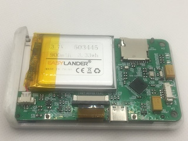
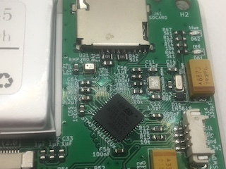

# Высотомер Sky-Meter

Инструмент для парашютиста - простой высотомер на базе барометра.

***
## Что умеет

* измерять высоту;
* определять начала подъёма и начало прыжка;
* писать в логбук историю прыжков: время взлёта, высота отделения, высота раскрытия;

***
## Внутри

***
## Документация

* [Исходники](doc/code.md) - где, что лежит, права на использование, помощь при компиляции.
* [Где скачать](doc/download.md)

***
## Известные проблемы

- повышенное энергопотребление в спящем режиме (850 мкА)

    В первой аппаратной версии применялся чип stm32f473 и энергопотребление всего устройства
    на его основе удалось снизить до 125 мкА, а в выключенном - до 85-90 мкА. И это
    при заявленных в документации 56 мкА (что-то дополнительно подребляет и сама плата).

    А вот на чипе stm32f411 при заявленных в документации 10 мкА получить потребление ниже
    60 мкА так и не удалось - но это на пустой прошивке. На боевой же прошивке почему-то
    не отключаются какие-то узлы, и потребление ~850 мкА. С этим ещё предстоит разобраться.

- нестабильная работа с SD-картой

    Проблема возникает из-за слабого питания, подаваемого на карту. В целях экономии заряда
    батареи питание на SD-карту выведено напрямую с пина микроконтроллера. Применение дополнительного
    транзистора в режиме ключа вызывает проблемы из-за низкого потребляемого тока карты (несколько мА).
    При инициализации карты ток возрастает и питание проседает, из-за чего карта сбрасывается.

    Некоторые карты всё же работают, но таких мало.

    На stm32g4xx работа карт от пина была гораздо стабильнее. Но всё же, на некоторых картах тоже
    были сбои.

    В качестве оперативной меры можно перерезать дорожку, ведущую к пину МК и соединить питание карты
    напрямую на 3.3v. Однако потребление в спящем режиме вместе с SD-картой возрастает до 3 мА.

- отсутствие приложения для импорта логбука

    Разработка отложена на неопределённый срок.

***
