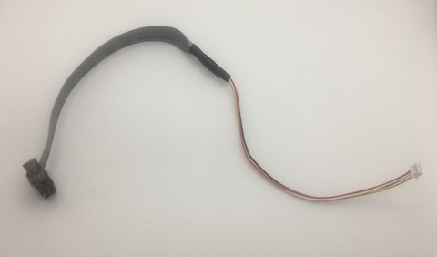
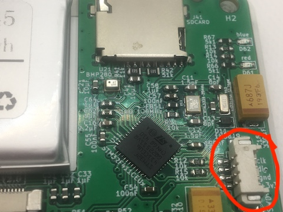
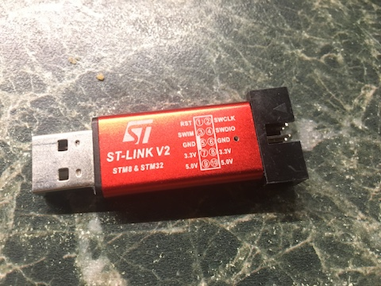

# Скачивание файлов

Стабильная версия прошивки:

* RU: [sky-meter.v1.0.stm32f411ceu.ru.bin](https://github.com/cliffanet/sky-meter/releases/download/v0.7.7/sky-meter.v1.0.stm32f411ceu.ru.bin)
* EN: [sky-meter.v1.0.stm32f411ceu.en.bin](https://github.com/cliffanet/sky-meter/releases/download/v0.7.7/sky-meter.v1.0.stm32f411ceu.en.bin)

## Обновление прошивки

Неодходимое оборудование:

- SWD-кабель

    

    

- программатор ST-Link v.2

    

- [Утилита взаимодействия по SWD-порту](https://www.st.com/en/development-tools/stm32cubeprog.html)

## История версий

[История версий и самые свежие файлы](https://github.com/cliffanet/sky-meter/releases)
